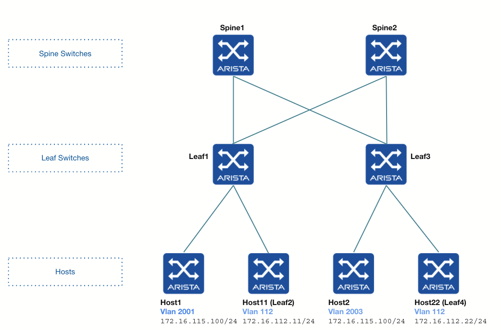
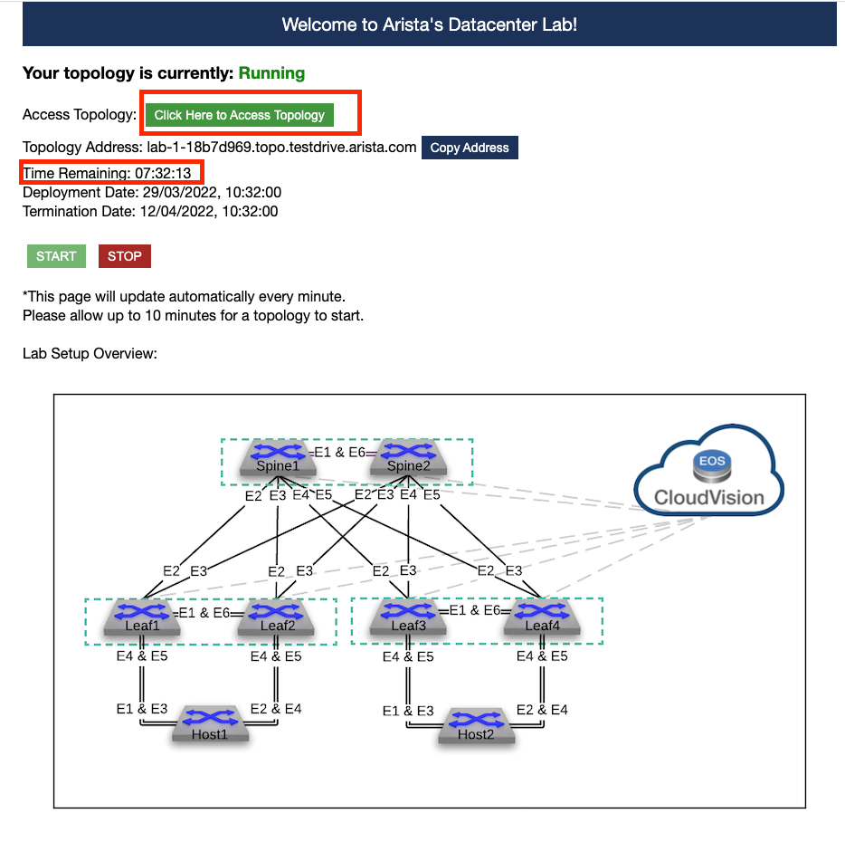
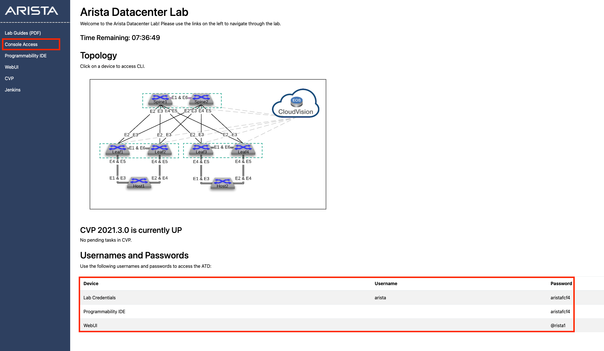
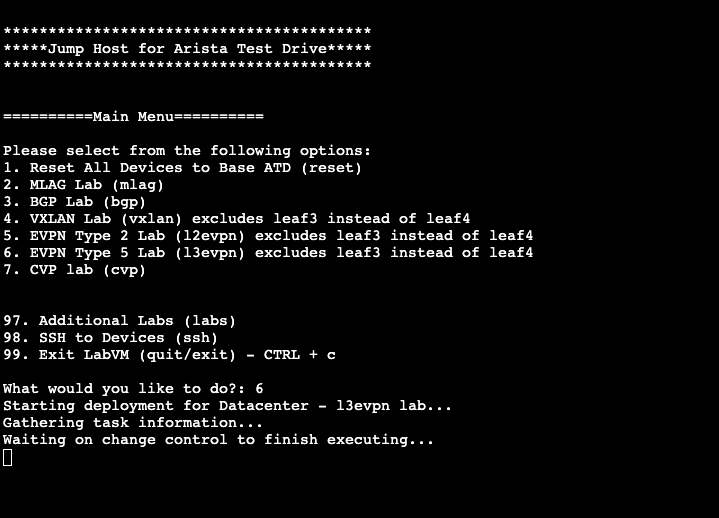
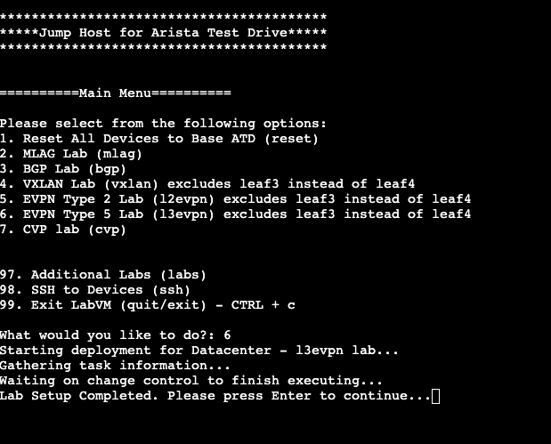
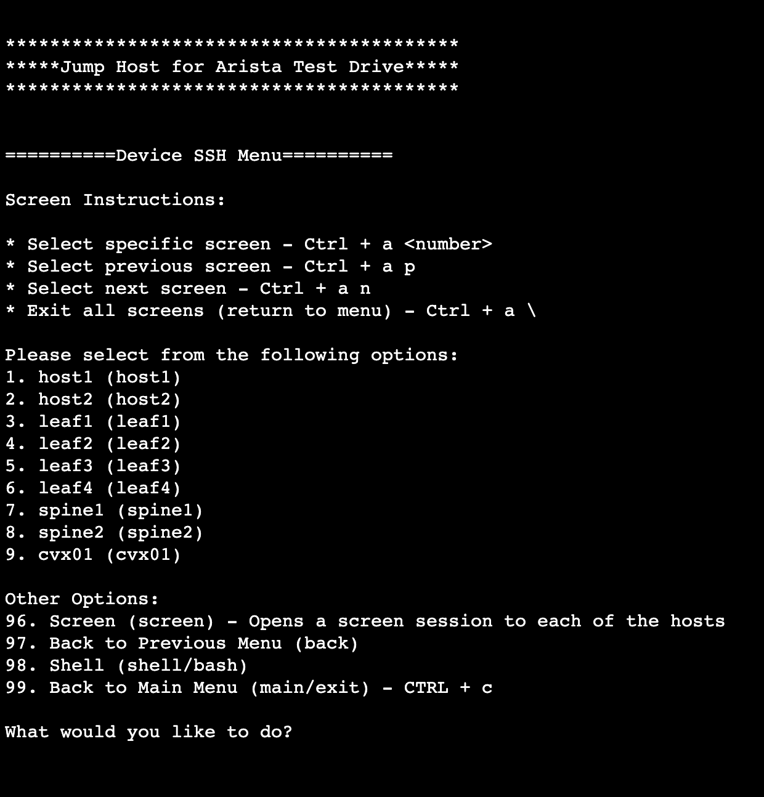

# ATD LAB 6 (type l3evpn)

# Goals

- Understand Assymmetric IRB
- Configure Assymmetric IRB
# Tasks

## Summary
- Configure the Overlay using VXLAN with EVPN on Leaf3
- Establish Connectivity Between Host 1 and Host 2 in VRF vrf1
- Identify VNIs used for encapsulation
- Identify Route Types used in a assymmetric EVPN IRB setup

## Detailed Tasks
- Launch lab 6 from the Arista Test Drive
- Configure vlan 112 with vni 1112 and an anycast SVI on Leaf1 and3
- Configure Leaf2 to be a host in vlan 112 connected to Leaf1
- Configure Leaf4 to be a host in vlan 112 connected to Leaf3
- Configure a static route on Host1 and Host2 for the subnet of vlan 112
- Test reachability between all hosts
- Check BGP EVPN route-types and routing table
- Do some tcpdumps to see the VNIs used in each case

### Launch ATD LAB 6

- Click on the ATD URL provided by Arista. A new page will open.
- Click on the green button named "Click Here to Access Topology"

Note that the lab will run for a certain amount of time depending on the setup. You can see the remaining time in this access page.

Click on Console Access, the second link on the left hand side

This is the jump host to access all the nodes of the lab and launch the script that will preset your labs.

Type 6 and enter. Wait until the script has finished running. This script configured Leaf and Spine switches for the lab except Leaf 3 that you will need to configure

Once the script has configured all the devices, you will see as above the following line:
Lab Setup Completed. Please press Enter to continue...

From now on you can either:
- Type 98 and SSH via the jump host to the devices that you want to configure
- Access the device via the GUI by hovering over the diagram and clicking on the devices

### Configure vlan 112

On Leaf1 and Leaf3
- Configure vlan 112 
- Configure a MAC VRF for this vlan
- Configure the mapping VLAN to VNI on the VXLAN interface using vni 1112
- Configure SVI with the anycast IP address 172.16.112.1/24 in vrf1

### Turn Leaf2 into Host11

Configure Leaf2 to be a host in vlan 112 connected to Leaf1

On Leaf2
- Configure interface Ethernet1 as a routed port
- Configure it with IP address 172.16.112.11
- Add static routes to vlan 2001 and vlan 2003

On Leaf1
- Configure interface Ethernet1 as an access port
in vlan 112

### Turn Leaf4 into Host22

Configure Leaf4 to be a host in vlan 112 connected to Leaf3

On Leaf4
- Configure interface Ethernet1 as a routed port
- Configure it with IP address 172.16.112.22
- Add static routes to vlan 2001 and vlan 2003

On Leaf3
- Configure interface Ethernet1 as an access port
in vlan 112

### Configure a static route on Host1 and Host2 for the subnet of vlan 112

On Host1 and Host2
Configure a static route to vlan 112

### Test reachability between all hosts

Ping from host1 to host11 and host22 for example

### Check BGP EVPN route-types and routing table

Use the following commands on the Leaf Switches
- show bgp evpn summmary
- show bgp evpn
- show bgp evpn vni xx
- show bgp evpn route-type ip-prefix ipv4
- show bgp evpn route-type ip-prefix x.x.x.x/y

### Identify VNI used for encapsulation

Do some tcpdumps to see the VNIs used in each case