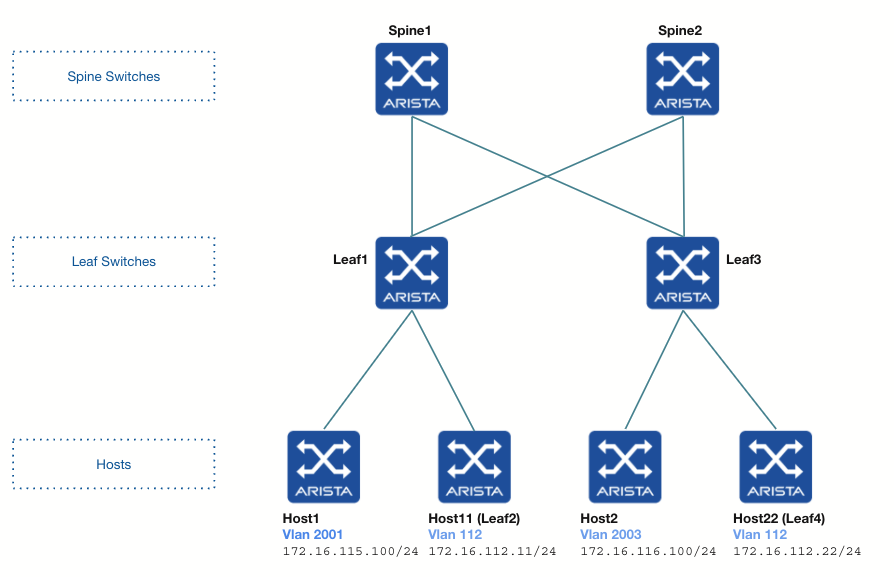

# ATD LAB 6 (type l3evpn)

# Goals

- Understand Asymmetric IRB
- Configure Asymmetric IRB
# Tasks

## Summary
- Configure EVPN VXLAN on Leaf3
- Establish Connectivity Between Host1, Host2, Host11 and Host22
- Identify VNIs used for encapsulation
- Identify Route Types used in a asymmetric EVPN IRB setup

## Detailed Tasks
- Launch lab 6 from the Arista Test Drive
- Remove vrf1 on Leaf1
- Configure EVPN VXLAN on Leaf3
- Configure vlan 112 with vni 1112 and an anycast SVI on Leaf1 and Leaf3
- Configure Host11 (Leaf2) to be a host in vlan 112 connected to Leaf1
- Configure Host 22 (Leaf4) to be a host in vlan 112 connected to Leaf3
- Configure static routes on Host11 and Host22
- Configure a static route on Host1 and Host2
- Test reachability between all hosts
- Check BGP EVPN route-types and routing table
- Do some tcpdumps to check the VNIs used in each case

## Lab Preparation
### Launch ATD LAB 6

[Go to the Lab Access link for this step](Lab&#32;Access)
### Remove VRF vrf1 on Leaf1

This lab has been initially set up for L3 EVPN.
Some changes need to be made in the configuration before starting the lab.

On Leaf1
- Remove the VRF vrf1 to VNI mapping on the VXLAN interface
- Remove the VRF vrf1 in the bgp configuration
- Remove VRF vrf1 on interface VLAN 2001
- Reconfigure the ip address virtual on interface VLAN 2001 - 172.16.115.1/24

### Configure EVPN VXLAN on Leaf3

On Leaf3:
- Configure Loopback0 using 172.16.0.5/32
- Configure Loopback1 using 3.3.3.3/32
- Configure P2P interfaces to Spine Switches (*)
- Configure BGP peering to Spine Switches for the Underlay
- Check BGP peers
- Configure BGP peering to Spine Switches for the Overlay
- Check EVPN BGP peers

(*) Hint: Look at the Spine Switches configuration and use LLDP
## Asymmetric IRB Lab
### Configure VLAN 112

On Leaf1 and Leaf3
- Configure VLAN 112 
- Configure a MAC VRF for this vlan
- Configure VLAN to VNI mapping on the VXLAN interface using vni 1112 for vlan 112
- Configure SVI with the anycast IP address - 172.16.112.1/24

### Configure VLANs 2001 and 2003

On Leaf1 and Leaf3
- Configure VLAN 2001 and VLAN 2003
- Configure a MAC VRF for these VLANs
- Configure VLAN to VNI mapping on the VXLAN interface using vni 2001 and 2003
- Configure SVI with the anycast IP address 172.16.115.1/24 for VLAN 2001
- Configure SVI with the anycast IP address 172.16.116.1/24 for VLAN 2003

On Leaf3:
- Configure virtual-router mac-address 00:1c:73:aa:bb:cc
- Configure Port-channel5 as an access port in VLAN 2003
- Add interface Ethernet5 to Port-channel5

### Turn Leaf2 into Host11

Configure Leaf2 to be a host in VLAN 112 connected to Leaf1

On Leaf2
- Configure interface Ethernet1 as a routed port
- Configure it with IP address 172.16.112.11/24
- Add a static route to VLAN 2001 - subnet 172.16.115.0/24
- Add a static route to VLAN 2003 - subnet 172.16.116.0/24

On Leaf1
- Configure interface Ethernet1 as an access port in VLAN 112
- Unshut interface Ethernet1
- Check connectivity from Leaf2 to its default gateway - 172.16.112.1

### Turn Leaf4 into Host22

Configure Leaf4 to be a host in VLAN 112 connected to Leaf3

On Leaf4
- Configure interface Ethernet1 as a routed port
- Configure it with IP address 172.16.112.22/24
- Add a static route to vlan 2001 - subnet 172.16.115.0/24
- Add a static route to vlan 2003 - subnet 172.16.116.0/24

On Leaf3
- Configure interface Ethernet1 as an access port in VLAN 112
- Check connectivity from Leaf4 to its default gateway - 172.16.112.1

### Configure a Static Route on Host1 and Host2

On Host1 and Host2
- Configure a static route to VLAN 112 - subnet 172.16.112.0/24

### Test Reachability between Hosts

From Host1 ping
- Host2
- Host11
- Host22

### Check BGP EVPN Route-types and Routing Tables

Use the following commands on the Leaf Switches and explore the outputs
- show bgp evpn summmary
- show bgp evpn
- show bgp evpn vni xx
- show bgp evpn route-type imet
- show bgp evpn route-type mac-ip

### Identify VNIs used for Encapsulation

- Run tcpdump on interfaces to Spine Switches
- Generate traffic betweens hosts across Leaf Switches
- Analyse tcpdump outputs and check the VNIs used each way

Note the following important points:
- When generating inter-vlan traffic, VNI numbers change according to the direction of the flow, thus the word asymmetric
- Every VLAN needs to be present on every Leaf Swicth even if there is no host present on the Leaf Switch
- Note that you can also generate intra-vlan traffic inside VLAN 112, thus the term IRB: Integrated Routing and Switching