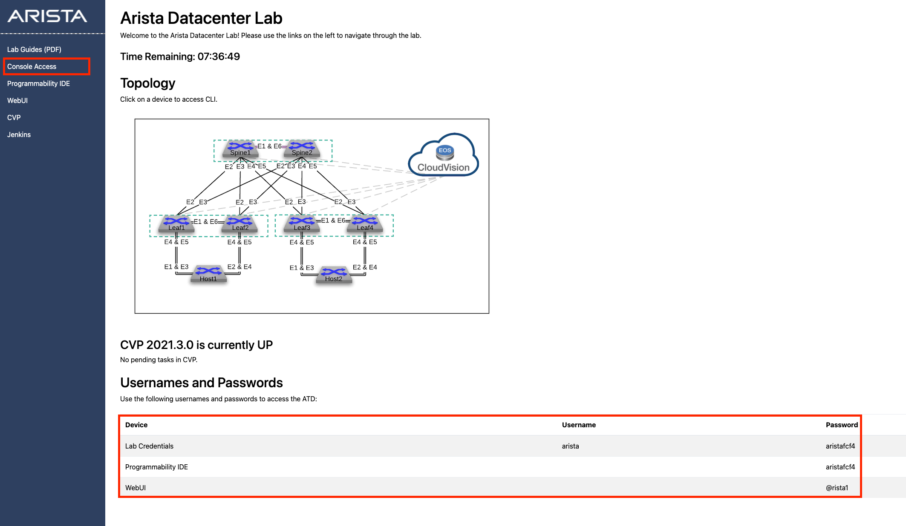
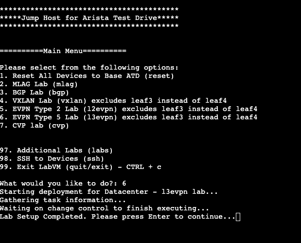

# ATD Lab Access and Preparation

- Click on the ATD URL provided by Arista. A new page will open.
- Click on the green button named "Click Here to Access Topology"

Note that the lab will run for a certain amount of time depending on the setup. You can see the remaining time in this access page.

- Click on Console Access, the second link on the left hand side.

The passwords are listed at the bottom of the page and are different in each lab environment.

This is the jump host to access all the nodes of the lab and launch the script that will preset your labs.

- Type 6 and enter
- Wait until the script has finished running

This script configures Leaf and Spine switches for the lab (except Leaf3 that you will need to configure).

Once the script has configured all the devices, you will see the following line:
Lab Setup Completed. Please press Enter to continue...

From now on you can either

- Type 98 and SSH via the jump host to the devices that you want to configure
- Access the device via the GUI by hovering over the diagram and clicking on the devices

