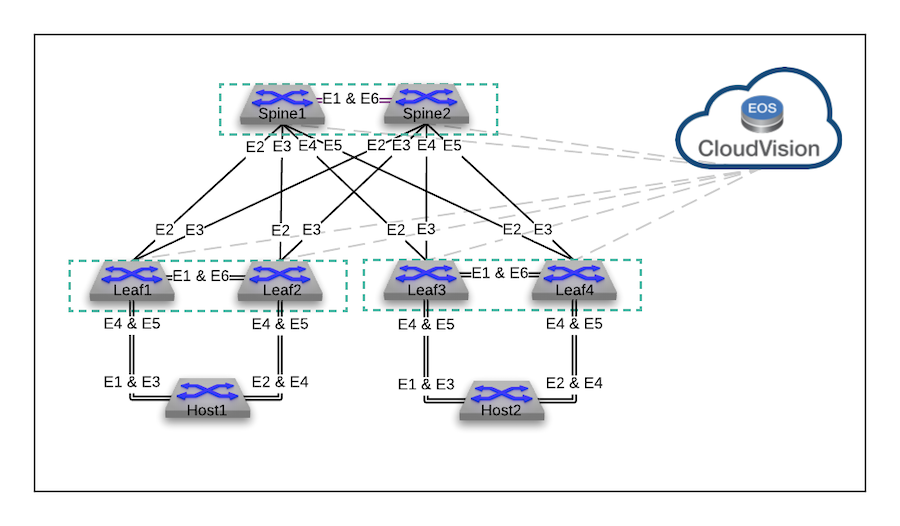

# Labs for Arista ATD

These labs have been built for the setup used in Arista Test Drive composed of the following devices:

- 2 Spine Switches
    - Spine1
    - Spine2
- 4 Leaf Switches
    - Leaf1
    - Leaf2
    - Leaf3
    - Leaf4
- 2 Hosts
    - Host1
    - Host2

These labs focus on EVPN IRB configurations and concepts.

There are the following labs:

- [Asymmetric IRB](Asymmetric-IRB)
- [Symmetric IRB](Symmetric-IRB)