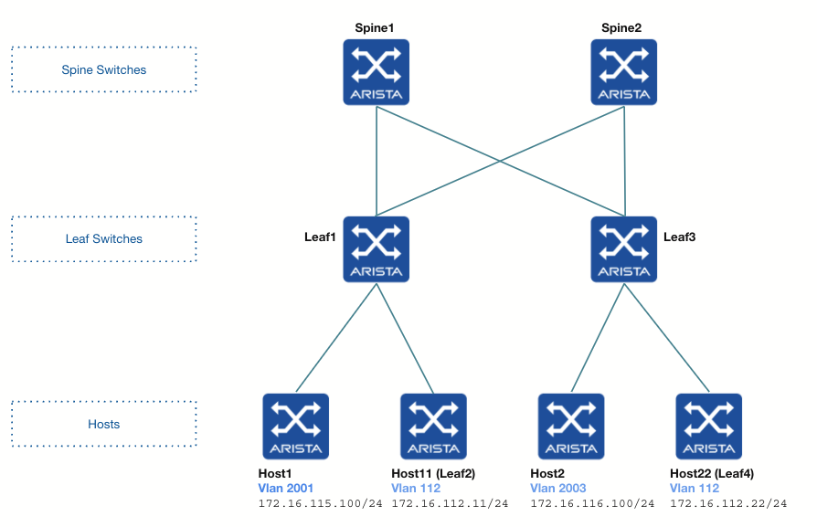
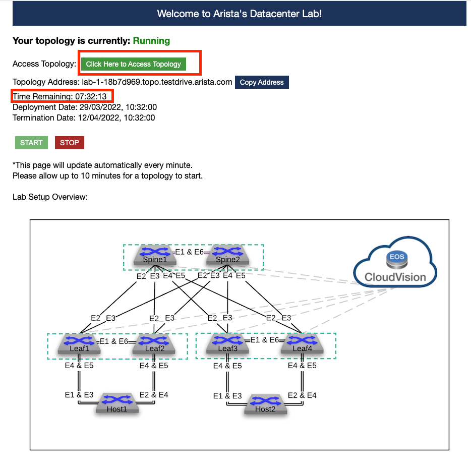
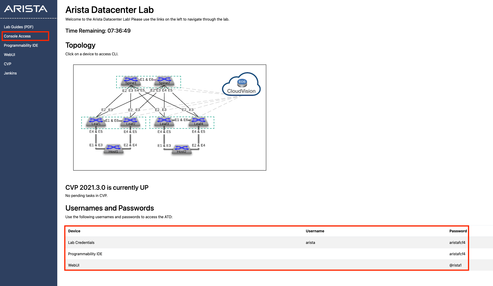
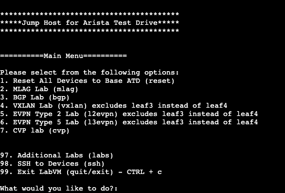
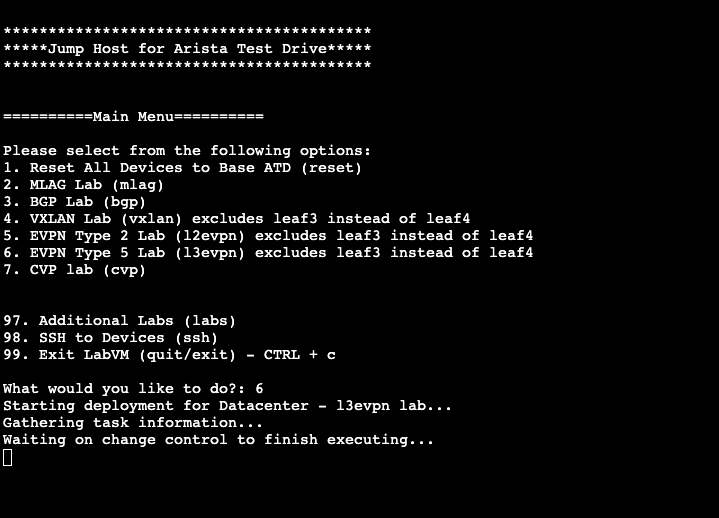
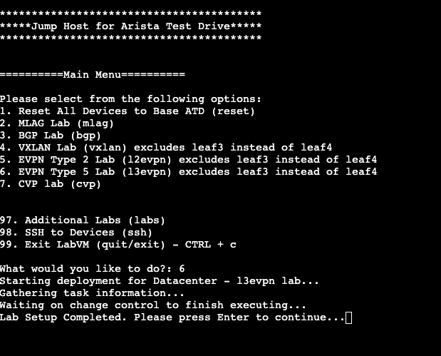
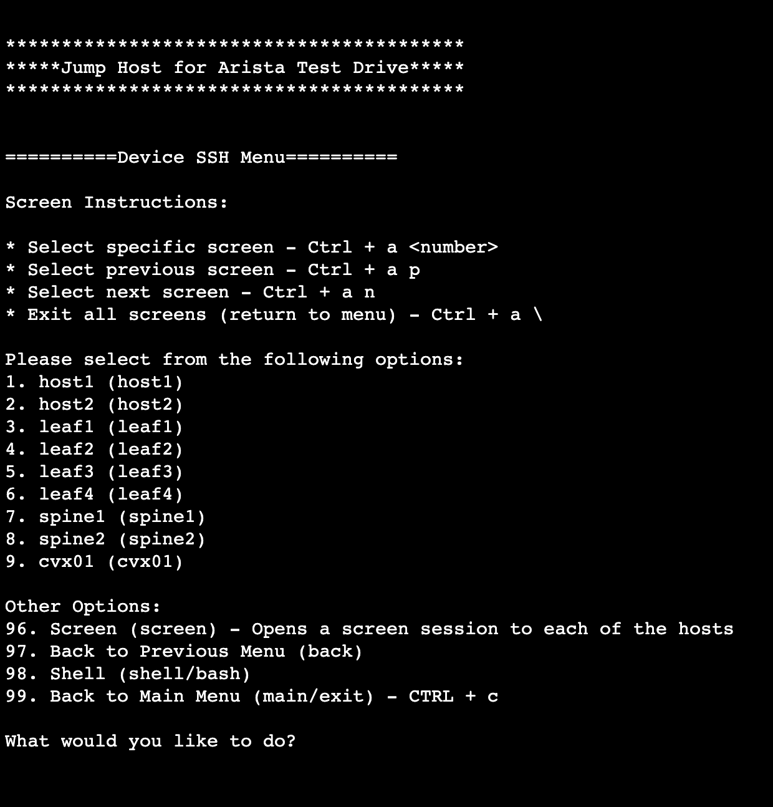

# ATD LAB 6 (type l3evpn)

# Goals

- Understand Symmetric IRB
- Configure Symmetric IRB
# Tasks

## Summary
- Configure EVPN VXLAN on Leaf3
- Establish Connectivity Between Host1, Host2, Host11 and Host22 in VRF vrf1
- Identify VNIs used for encapsulation
- Identify Route Types used in a symmetric EVPN IRB setup

## Detailed Tasks
- Launch lab 6 from the Arista Test Drive
- Configure EVPN VXLAN on Leaf3
- Configure vlan 112 with vni 1112 and an anycast SVI on Leaf1 and Leaf3
- Configure Host11 (Leaf2) to be a host in vlan 112 connected to Leaf1
- Configure Host 22 (Leaf4) to be a host in vlan 112 connected to Leaf3
- Configure static routes on Host11 and Host22
- Configure a static route on Host1 and Host2
- Test reachability between all hosts
- Check BGP EVPN route-types and routing table
- Do some tcpdumps to check the VNIs used in each case

## Lab Preparation
### Launch ATD LAB 6

- Click on the ATD URL provided by Arista. A new page will open.
- Click on the green button named "Click Here to Access Topology"

Note that the lab will run for a certain amount of time depending on the setup. You can see the remaining time in this access page.

- Click on Console Access, the second link on the left hand side.

The passwords are listed at the bottom of the page and are different in each lab environment.

This is the jump host to access all the nodes of the lab and launch the script that will preset your labs.

- Type 6 and enter
- Wait until the script has finished running

This script configures Leaf and Spine switches for the lab (except Leaf3 that you will need to configure).

Once the script has configured all the devices, you will see the following line:
Lab Setup Completed. Please press Enter to continue...

From now on you can either:
- Type 98 and SSH via the jump host to the devices that you want to configure
- Access the device via the GUI by hovering over the diagram and clicking on the devices

### Configure EVPN VXLAN on Leaf3

On Leaf3:
- Configure Loopback0 using 172.16.0.5/32
- Configure Loopback1 using 3.3.3.3/32
- Configure vlan 2003
- Configure P2P interfaces to Spine Switches (*)
- Configure BGP peering to Spine Switches for the Underlay
- Check BGP peers
- Configure BGP peering to Spine Switches for the Overlay
- Check EVPN BGP peers
- Configure a VRF instance named vrf1 and enable routing for it

(*) Hint: Look at the Spine Switches configuration and use LLDP
## Symmetric IRB Lab
### Configure VLAN 112

On Leaf1 and Leaf3
- Configure vlan 112 
- Configure a MAC VRF for this vlan
- Configure VLAN to VNI mapping on the VXLAN interface using vni 1112 for vlan 112
- Configure SVI with the anycast IP address 172.16.112.1/24 in vrf1

### Configure vrf1 Mapping

On Leaf3:
- Configure VRF mapping for vrf1 using VNI 1001
- Configure the VRF under BGP
### Turn Leaf2 into Host11

Configure Leaf2 to be a host in vlan 112 connected to Leaf1

On Leaf2
- Configure interface Ethernet1 as a routed port
- Configure it with IP address 172.16.112.11
- Add static routes to vlan 2001 and vlan 2003

On Leaf1
- Configure interface Ethernet1 as an access port in vlan 112
- Unshut interface Ethernet1

### Turn Leaf4 into Host22

Configure Leaf4 to be a host in vlan 112 connected to Leaf3

On Leaf4
- Configure interface Ethernet1 as a routed port
- Configure it with IP address 172.16.112.22
- Add static routes to vlan 2001 and vlan 2003

On Leaf3
- Configure interface Ethernet1 as an access port in vlan 112

### Configure a Static Route on Host1 and Host2

On Host1 and Host2
- Configure a static route to vlan 112

### Test Reachability between Hosts

From host1 ping
- Host2
- Host11
- Host22

### Check BGP EVPN Route-types and Routing Tables

Use the following commands on the Leaf Switches and explore the outputs
- show bgp evpn summmary
- show bgp evpn
- show bgp evpn vni xx
- show bgp evpn route-type imet
- show bgp evpn route-type mac-ip
- show bgp evpn route-type ip-prefix ipv4
- show bgp evpn route-type ip-prefix x.x.x.x/y

### Identify VNIs used for Encapsulation

- Run tcpdump on interfaces to Spine Switches
- Generate traffic betweens hosts across Leaf Switches
- Analyse tcpdump outputs and check the VNIs used each way

Note the following important points:
- When generating inter-vlan traffic, the VNI numbers is the same both directions of the flow, thus the word symmetric
- VLANs don't need to be present on every Leaf Swicth if there is no host present on the Leaf Switch
- Note that you can also generate intra-vlan traffic inside VLAN 112, thus the term IRB: Integrated Routing and Switching